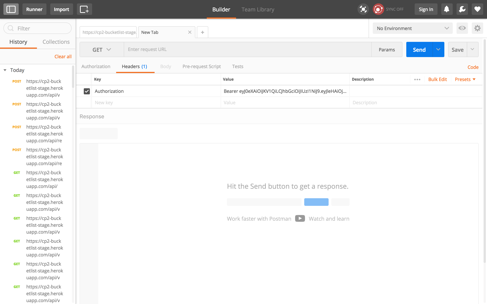

[](https://travis-ci.org/georgreen/CP2A-BucketList-Application) [](https://coveralls.io/github/georgreen/CP2A-BucketList-Application?branch=develop) [](https://www.quantifiedcode.com/app/project/675d48c654bc43aa9936634b72415f36) [](https://www.codacy.com/app/georgreen/CP2A-BucketList-Application?utm_source=github.com&amp;utm_medium=referral&amp;utm_content=georgreen/CP2A-BucketList-Application&amp;utm_campaign=Badge_Grade) [](https://github.com/georgreen/CP2A-BucketList-Application/blob/master/LICENSE) []() [](https://www.python.org/dev/peps/pep-0008/)


# BucketList API
 Create an API for an online Bucket List service using Flask.

```Bucket list``` can also be refered to as ```things/something to do before you die```. It is possibly derived from the English idiom to kick the bucket. It is used as an informal way or as a slang and it is believed that the idiom comes from method of execution such as hanging. The origin of the word remains unclear. [Read more here.](https://www.quora.com/Why-is-a-bucket-list-called-a-bucket-list)

- ## API
This App exposes endpoints that allows ```clients/Users``` to manage a bucketlist of their choise.

- ## Available Resource Endpoints

|Method | Endpoint | Usage |
| ---- | ---- | --------------- |
|POST| `/api/v1.0/register` |  Register a user. |
|POST| `/api/v1.0/login` | Login user.|
|POST| `/api/v1.0/bucketlists/` | Create a new bucket list. |
|GET| `/api/v1.0/bucketlists/` | Get all the created bucket lists. |
|GET| `/api/v1.0/bucketlists/<bucket_id>` | Get a single bucket list. |
|PUT| `/api/v1.0/bucketlists/<bucket_id>` | Update a single bucket list. |
|DELETE| `/api/v1.0/bucketlists/<bucket_id>` | Delete single bucket list. |
|POST| `/api/v1.0/bucketlists/<bucket_id>/items` | Add a new item to this bucket list. |
|GET| `/api/v1.0/bucketlists/<bucket_id>/items/<item_id>` | Get an item from this bucket list. |
|PUT|`/api/v1.0/bucketlists/<bucket_id>/items/<item_id>` | Update an item in this bucket list. |
|PATCH|`/api/v1.0/bucketlists/<bucket_id>/items/<item_id>` | Patch an item in this bucket list. |
|DELETE|`/api/v1.0/bucketlists/<bucket_id>/items/<item_id>` | Delete this single bucket list. |
|GET| `/api/v1/bucketlists?per_page=10&page=1` | Pagination to get 10 bucket list records.|
|GET| `/api/v1/bucketlists?q=a bucket` | Search for bucket lists with name like a bucket.


## Getting Started
- To run on local machine git clone this project :
```
 $ git clone https://github.com/georgreen/CP2A-BucketList-Application.git
 ```

 Copy and paste the above command in your terminal, the project will be downloaded to your local machine.

- To consume API in client of choice navigate to:
 ```
 https://cp2-bucketlist-stage.herokuapp.com/api/̨
 ```
 This link will open up a running version of the project on heroku, a detailed documentation is provided on the site.

### Prerequisites
The application is built using python: flask framework.
>[Flask](http://flask.pocoo.org/) is a microframework for the Python programming language.


To Install python checkout:
```
https://www.python.org/
```


### Installing
For this section I will assume you have python3 and it's configured on your machine. </br>
Navigate to the folder you cloned and run: </br>

- Install Requirements
```
$ pip install -r requirements.txt
```

- Configure Environment.

```
$ export APP_SETTINGS="default"
$ export DEV_DATABASE="path to your database"
$ export SECRET="Secret Key Here"
```
> Note replace the value for DEV_DATABASE with real database path and SECRET with a strong string value


- Configure database
```
$ python manage.py database init
$ python manage.py database migrate
$ python manage.py database upgrade
```

- Run App
```
$ python manage.py runserver
```
The app should be accessiable via : http://127.0.0.1:5000/

### Session Examples
To Follow along with this examples get postman : A powerful GUI platform to make your API requests. [READ MORE HERE](https://www.getpostman.com/)
- Set up postman
 

- Signup/ register

    - Post data in the format below to the register endpoint: ```/api/v1.0/register```
    ```
    {
	"username":"geogreen ngunga",
	"email":"demoenail@gmail.com",
	"password":"demoPassword12#"
    }
    ```


- Login

    - Post data in the format below to the login endpoint : ```/api/v1.0/login```
```
{
"email":"demoenail@gmail.com",
"password":"demoPassword12#"
}
```
    - Copy the token returned and add it into the headers as a key pair value of ```Authorization : Bearer [put token here]```

    
    </br></br>

- Create BucketList

    - Post data in the format below to the bucketlist endpoint: ```/api/v1.0/bucketlists/```
```
{
"name":"new bucketlist name"
}
```

- Get BucketList

    - Get data from the  bucketlist endpoint: ```/api/v1.0/bucketlists/```
    </br></br>

- Get one BucketList

    - Get data from the  bucketlist endpoint: ```/api/v1.0/bucketlists/bucket_id```
    </br></br>

- Update BucketList

    - Put data to the endpoint :```/api/v1.0/bucketlists/bucket_id```

    ```
    {
        "name":"new name"
    }
    ```


- Delete BucketList

    - Delete data at an endpoint:```/api/v1.0/bucketlists/bucket_id``` </br></br>

- Add Item to BucketList

    - Post data to ```/api/v1.0/bucketlists/<bucket_id>/items``` in the format:
    ```
    {
        "name":"Item name",
        "description":"Item description"
    }
    ```

- Get Item from BucketList

    - Get data from the endpoint:```/api/v1.0/bucketlists/<bucket_id>/items/<item_id>```
    </br></br>

- Update Item from BucketList

    - Put data to ```/api/v1.0/bucketlists/<bucket_id>/items/<item_id>``` in the format:
    ```
    {
        "name":"This will update name",
        "description":"This will update description"
    }
    ```

- Patch Item from BucketList

    - Patch item endpoint ```/api/v1.0/bucketlists/<bucket_id>/items/<item_id> ``` data format:
    ```
    {
        "done":"True"
    }
    ```

- Delete Item from BucketLists

    - Delete item at the endpoint ``` /api/v1.0/bucketlists/<bucket_id>/items/<item_id>```


- Search for BucketLists

- Paginate BucketLists

## Running the tests

```
$ python manage.py test
```
- With Coverage

```
 $ nosetests --rednose --with-coverage --cover-package=app -v
```

- Coding style tests

[Pep8](https://www.python.org/dev/peps/pep-0008/) standards are followed in project.

```
$ pep8 app --count
```

## Deployment

- [Check this out to deploy to heroku](https://devcenter.heroku.com/articles/getting-started-with-python#introduction)

## Built With

* [Flask](http://flask.pocoo.org/) - The web framework used
* [Flaskrestplus](https://flask-restplus.readthedocs.io/en/stable/) - Extension for Flask that adds support for quickly building REST APIs.
* [webargs](https://webargs.readthedocs.io/en/latest/) - webargs is a Python library for parsing HTTP request arguments
* [Flask JWT Extended](https://flask-jwt-extended.readthedocs.io/en/latest/) - Extension for Flask that adds support for tokken authentication

## Contributing

- Please Fork me! :-)

## Versioning

- [Checkout our releases](https://github.com/georgreen/CP2A-BucketList-Application/releases)

## Authors

* **Georgreen Mamboleo** - *Initial work* - [Dojo](https://github.com/georgreen/Geoogreen-Mamboleo-Dojo-Project)


## License

- This project is licensed under the MIT License - see the [LICENSE.md](LICENSE.md) file for details

## Acknowledgments

* [ANDELA ](https://andela.com/) - We are hiring !
* [TARACHA](https://github.com/TheDancerCodes) - Cool Human being.
